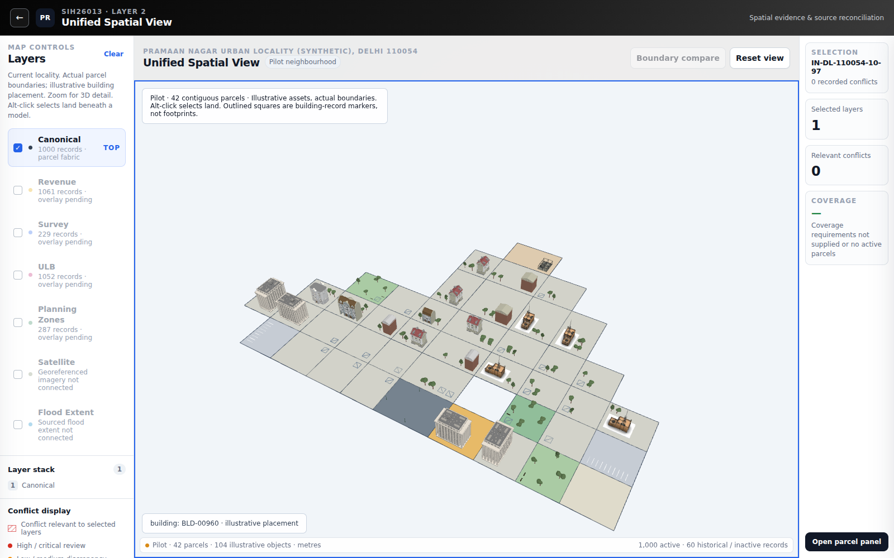

# Stage 5 — representative pilot neighbourhood

The default page renders **42 actual contiguous parcels in CELL-10**, selected by breadth-first traversal of shared boundary edges from the supplied ROAD_ACCESS_CORRIDOR until the declared category coverage is reached. IDs do not determine spatial placement. No cadastral vertex or calibrated model scale was changed. The remaining locality is not populated.

Open default `index.html` through a local HTTP server for the pilot. `?mode=fabric` retains Stage 4's entire unpopulated parcel fabric; `?mode=calibration` retains Stage 3's complete 42-asset viewer. All original assets remain byte-identical and all previous regression suites pass.

## What is rendered

- 17 property categories; 104 illustrative placements.
- 20 building/construction GLB placements and 18 flat building-record markers. Markers are explicitly labelled; they are neither measured footprints nor fake extrusions.
- 56 trees, six benches and four lights.
- Two park parcels and one green belt retain their actual ground geometry. Park assemblies were too large at calibrated scale, so planting and benches represent these spaces.
- Two actual parking parcels receive 19 illustrative bay divider lines. These are visual paint, not surveyed stall geometry, parking capacity or legal allocation. Calibrated parking GLBs do not fit and were not shrunk.
- One actual access parcel supplies road context. No additional legal road parcels, inferred connecting streets or road rights were created.
- Building-record multiplicity: 5 parcels with no building records, 36 with one, 1 with multiple. The college's BLD-00953 and BLD-00954 remain independently selectable markers because the pack has no suitable college-scale model.

## Semantic decisions

Apartment/group-housing types use the apartment family. Ordinary residential uses general building-9 only for records with at least four supplied floors; low-rise homes with no suitable model receive markers. Commercial uses com-1; larger commercial towers are excluded. Government candidates are gov-1/gov-3 but neither fits this pilot's government parcel. Under-construction uses construction assets; redevelopment alone is not assumed to be active construction. Vacant land stays empty. Utility/civic/college records without a matching asset retain record markers. No landmark, windmill or barn is substituted merely to use the asset inventory.

GLBs are illustrative archetypes: their appearance, storey count and floor area do not assert the exact surveyed building. Calibration is untouched, and no per-axis or per-parcel resizing is used. Registry dimensions define containment envelopes. Tree heights remain 5–6.5m versus 11–16m apartment models. Six of the seven apartment variants fit; the same small commercial model appears four times, a visible limitation of the asset pack.

## Placement and determinism

`tools/build_pilot.py` owns selection and placement policy. Renderer `map/pilot-neighbourhood.js` consumes only normalized plan IDs/transforms. Actual building records determine multiplicity; canonical building_count is not used to fabricate extra identities. Source footprint evidence is considered only when its complete polygon lies within the associated parcel. Crossing observations remain untouched and are logged instead of clipped into a false footprint.

Orientation uses an adjoining actual road edge where available, otherwise a contained source footprint, otherwise the parcel's longest minimum-rectangle edge. Most parcels have the same source orientation, so similar model yaw is expected. Front doors are not identified in GLB metadata; edge alignment does not claim entrance alignment.

Candidates are tested within a parcel inset. Buildings use a 2m visual setback, trees 1.5m, benches 1.2m and lights 0.8m; these are illustrative configuration choices, not statutory rules. Envelopes, including tree crowns, must fit wholly inside the inset. A 0.6m separation check prevents object overlap, including across neighbouring parcels. Placement is off-centre and ranked by available footprint/access or boundary relationships. Park trees/lights have explicit perimeter anchors. SHA-256 of stable IDs breaks ties and chooses permitted variants; no Math.random or index-based parcel relocation is used.

## Acceptance checks

Python topology/placement checks verify shared-edge connectivity, every containment/setback, no pairwise model-envelope intersections, parking-marking containment, semantic family restrictions and complete 0/1/multiple building-record representation. Browser checks verify calibrated world bounds and ground contact, raycasting for buildings and underlying land, a real pointer click opening the right parcel, deterministic reload, and template reuse. The image below was visually inspected for scale, orientation, setbacks, readable boundaries, trees/benches, parking paint and access placement.

Performance: 15 distinct GLB loads; reused geometry/materials. Trees, benches and lights use static instancing with per-instance identities. Draw calls decreased from 669 to 524; rendered triangles 423,882. In the software-rendered test, sampled animation-frame turnaround was median 16.6ms, p95 136.7ms. This short measurement includes browser scheduling and is **not** a hardware GPU benchmark or production frame-rate guarantee. Idle rendering remains event-driven.

## Problems before city-wide expansion

1. **Road connectivity is not established.** This is a placement pilot, not a verified traversable neighbourhood. Most parcels lack explicit frontage/access links. Do not present invented streets as cadastral truth.
2. **Asset coverage is incomplete.** Low-rise residential, college/utility and small civic models are needed. Park/parking assemblies are too large; smaller assemblies or separately calibrated appropriate source assets are needed. Empty/marked parcels are intentional.
3. **Source footprint disagreement remains.** See the per-building issues in `data/pilot-plan.json`; crossing observed footprints cannot safely dictate placement. No correction or authority decision was fabricated.
4. **Draw calls remain high.** Although instancing helps, complex building assets still dominate. Profile target hardware and consider model-level draw-call reduction/LOD and cell loading before expanding.
5. **Underlying topology risks persist.** Stage 4's canonical overlaps were not repaired by decoration. Pilot placement envelopes do not overlap, but that does not certify the cadastral fabric.

## Reproduction

`npm ci`; `npm run test:install-browser`; `npm test` runs pilot, dataset, asset and previous foundation/UI tests. Install Python requirements from `tools/requirements-import.txt`; `python tests/test_pilot.py` runs placement validation. Regenerate using `python tools/build_pilot.py /path/to/PRAMAN_DATA`, then `python tools/report_pilot.py` after browser tests. The supplied property_type column is read at build time; rendering never reads workbook column names. Raw/evaluation files remain excluded.

## Per-parcel inventory

| Actual parcel ID | Property type | Building records represented | GLB / marker count |
|---|---|---:|---|
| IN-DL-110054-10-96 | ROAD_ACCESS_CORRIDOR | 0 | 0 / 0 |
| IN-DL-110054-10-86 | COLLEGE_TRAINING_CENTRE | 2 | 0 / 2 |
| IN-DL-110054-10-95 | WATER_INFRASTRUCTURE | 1 | 0 / 1 |
| IN-DL-110054-10-97 | LOCAL_SHOPPING_COMPLEX | 1 | 1 / 0 |
| IN-DL-110054-10-85 | GOVERNMENT_LAND | 1 | 0 / 1 |
| IN-DL-110054-10-76 | APARTMENT_BLOCK | 1 | 1 / 0 |
| IN-DL-110054-10-94 | ELECTRICAL_SUBSTATION | 1 | 0 / 1 |
| IN-DL-110054-10-98 | OFFICE_COMMERCIAL_PLOT | 1 | 1 / 0 |
| IN-DL-110054-10-75 | APARTMENT_BLOCK | 1 | 1 / 0 |
| IN-DL-110054-10-84 | MIXED_USE_BUILDING | 1 | 0 / 1 |
| IN-DL-110054-10-77 | BUILDER_FLOOR | 1 | 1 / 0 |
| IN-DL-110054-10-66 | APARTMENT_BLOCK | 1 | 1 / 0 |
| IN-DL-110054-10-93 | UTILITY_PARCEL | 1 | 0 / 1 |
| IN-DL-110054-10-88 | GREEN_BELT | 1 | 0 / 1 |
| IN-DL-110054-10-99 | PUBLIC_PARK | 0 | 0 / 0 |
| IN-DL-110054-10-74 | APARTMENT_BLOCK | 1 | 1 / 0 |
| IN-DL-110054-10-65 | APARTMENT_BLOCK | 1 | 1 / 0 |
| IN-DL-110054-10-83 | MIXED_USE_BUILDING | 1 | 0 / 1 |
| IN-DL-110054-10-78 | BUILDER_FLOOR | 1 | 0 / 1 |
| IN-DL-110054-10-67 | BUILDER_FLOOR | 1 | 0 / 1 |
| IN-DL-110054-10-56 | APARTMENT_BLOCK | 1 | 1 / 0 |
| IN-DL-110054-10-92 | PARKING_AREA | 0 | 0 / 0 |
| IN-DL-110054-10-89 | WATER_INFRASTRUCTURE | 1 | 0 / 1 |
| IN-DL-110054-10-100 | VACANT_PLOT | 0 | 0 / 0 |
| IN-DL-110054-10-64 | UTILITY_PARCEL | 1 | 0 / 1 |
| IN-DL-110054-10-73 | APARTMENT_BLOCK | 1 | 1 / 0 |
| IN-DL-110054-10-55 | APARTMENT_BLOCK | 1 | 1 / 0 |
| IN-DL-110054-10-82 | OFFICE_COMMERCIAL_PLOT | 1 | 1 / 0 |
| IN-DL-110054-10-68 | BUILDER_FLOOR | 1 | 0 / 1 |
| IN-DL-110054-10-79 | BUILDER_FLOOR | 1 | 0 / 1 |
| IN-DL-110054-10-57 | BUILDER_FLOOR | 1 | 1 / 0 |
| IN-DL-110054-10-46 | APARTMENT_BLOCK | 1 | 1 / 0 |
| IN-DL-110054-10-90 | PARKING_AREA | 0 | 0 / 0 |
| IN-DL-110054-10-63 | PUBLIC_PARK | 1 | 0 / 1 |
| IN-DL-110054-10-72 | APARTMENT_BLOCK | 1 | 1 / 0 |
| IN-DL-110054-10-45 | APARTMENT_BLOCK | 1 | 1 / 0 |
| IN-DL-110054-10-81 | RETAIL_SHOP | 1 | 1 / 0 |
| IN-DL-110054-10-69 | BUILDER_FLOOR | 1 | 0 / 1 |
| IN-DL-110054-10-58 | BUILDER_FLOOR | 1 | 1 / 0 |
| IN-DL-110054-10-80 | BUILDER_FLOOR | 1 | 1 / 0 |
| IN-DL-110054-10-47 | BUILDER_FLOOR | 1 | 0 / 1 |
| IN-DL-110054-10-36 | UNDER_CONSTRUCTION_PLOT | 1 | 1 / 0 |

## Unique placement issue counts

| Issue | Records |
|---|---:|
| No semantically suitable calibrated GLB fits; flat record marker only | 18 |
| Observed footprint crosses parcel; not used for placement | 33 |
| Park assembly does not fit; planting and benches used | 2 |
| Calibrated parking assemblies too large; parcel surface only | 2 |

Full asset placements, exact footprint envelopes, source-related issue IDs, semantic classifications, orientation provenance and selection adjacency are in `data/pilot-plan.json`.
